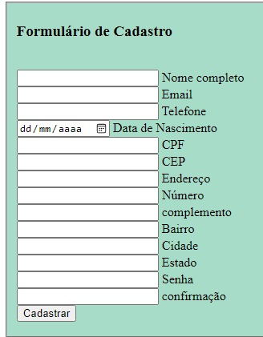

# Indice

[Formulário_Cadastro](#formulario_cadastro)  
[Descrição](#descrição)  
[Introduçao](#introduçao)  
[Funcionalidade](#funcionalidade)  
[Tecnologias Utilizadas](#tecnologias-utilizadas)  
[Fontes Consulta](#fontes-consulta)  
[Autores](#autores)  

# Formulário de Cadastro

## Descrição
O formulário de cadastro foi executado em sala de aula, fazendo com que tenha funcionalidade de preencher os campos de login.
## Introdução
Realizando o projeto aprendemos á fazer uma página de login
## Funcionalidade
Executar formulário de cadastro 
## Tecnologias Utilizadas
* ``HTML5``
* ``CSS3``
* ``VSCODE`` 
* ``JAVASCRIPT``
* ``GITHUB``
* ``GIT``
## Fontes Consulta
* [Github](https://github.com/limaxju/-Cadastro.git)
## Autores
Julia Eduarda de Lima Barbosa